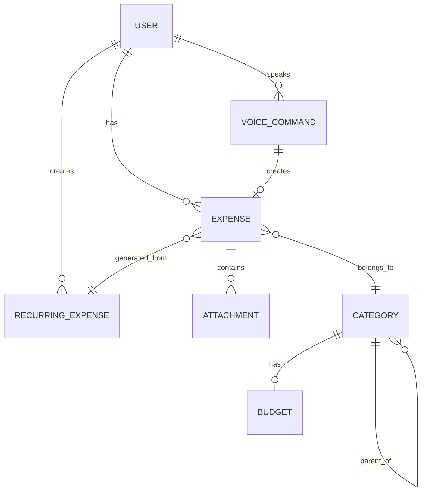

# Just Spent - Data Models Specification

## Overview
This document defines the complete data model architecture for Just Spent, ensuring consistency across iOS and Android platforms while maintaining platform-specific optimizations.

## Core Data Models

### 1. Expense Model

#### Schema Definition
```typescript
interface Expense {
  // Identifiers
  id: string                    // UUID
  userId: string                 // User identifier
  syncId?: string               // Cloud sync identifier
  
  // Financial Data
  amount: Decimal               // Precise decimal (2-4 places)
  currency: CurrencyCode        // ISO 4217 (AED, USD, EUR, etc.)
  convertedAmount?: Decimal     // Base currency equivalent
  exchangeRate?: Decimal        // Rate used for conversion
  
  // Categorization
  category: Category            // Primary category
  subcategory?: string          // Optional subcategory
  tags?: string[]               // User-defined tags
  
  // Details
  merchant?: string             // Merchant/vendor name
  description?: string          // User description
  notes?: string                // Additional notes
  
  // Location
  location?: Location           // Transaction location
  
  // Temporal
  transactionDate: DateTime     // When expense occurred
  createdAt: DateTime           // Record creation time
  updatedAt: DateTime           // Last modification
  
  // Source
  source: ExpenseSource         // How expense was created
  voiceTranscript?: string      // Original voice command
  
  // Media
  attachments?: Attachment[]    // Receipts, images
  
  // Status
  status: ExpenseStatus         // Current status
  isRecurring: boolean          // Recurring expense flag
  recurringId?: string          // Link to recurring pattern
  
  // Metadata
  metadata?: Map<string, any>   // Extensible metadata
}
```

#### iOS Implementation (Core Data)
```swift
// Expense+CoreDataClass.swift
@objc(Expense)
public class Expense: NSManagedObject {
    @NSManaged public var id: UUID
    @NSManaged public var userId: String
    @NSManaged public var syncId: String?
    
    @NSManaged public var amount: NSDecimalNumber
    @NSManaged public var currency: String
    @NSManaged public var convertedAmount: NSDecimalNumber?
    @NSManaged public var exchangeRate: NSDecimalNumber?
    
    @NSManaged public var category: String
    @NSManaged public var subcategory: String?
    @NSManaged public var tags: [String]?
    
    @NSManaged public var merchant: String?
    @NSManaged public var expenseDescription: String?
    @NSManaged public var notes: String?
    
    @NSManaged public var latitude: Double
    @NSManaged public var longitude: Double
    
    @NSManaged public var transactionDate: Date
    @NSManaged public var createdAt: Date
    @NSManaged public var updatedAt: Date
    
    @NSManaged public var source: String
    @NSManaged public var voiceTranscript: String?
    
    @NSManaged public var attachments: Set<Attachment>?
    
    @NSManaged public var status: String
    @NSManaged public var isRecurring: Bool
    @NSManaged public var recurringId: String?
    
    @NSManaged public var metadata: Data? // JSON encoded
}
```

#### Android Implementation (Room)
```kotlin
// Expense.kt
@Entity(tableName = "expenses")
data class Expense(
    @PrimaryKey
    val id: String = UUID.randomUUID().toString(),
    
    @ColumnInfo(name = "user_id")
    val userId: String,
    
    @ColumnInfo(name = "sync_id")
    val syncId: String? = null,
    
    @ColumnInfo(name = "amount")
    val amount: BigDecimal,
    
    @ColumnInfo(name = "currency")
    val currency: String,
    
    @ColumnInfo(name = "converted_amount")
    val convertedAmount: BigDecimal? = null,
    
    @ColumnInfo(name = "exchange_rate")
    val exchangeRate: BigDecimal? = null,
    
    @ColumnInfo(name = "category")
    val category: Category,
    
    @ColumnInfo(name = "subcategory")
    val subcategory: String? = null,
    
    @ColumnInfo(name = "tags")
    @TypeConverters(StringListConverter::class)
    val tags: List<String>? = null,
    
    @ColumnInfo(name = "merchant")
    val merchant: String? = null,
    
    @ColumnInfo(name = "description")
    val description: String? = null,
    
    @ColumnInfo(name = "notes")
    val notes: String? = null,
    
    @Embedded
    val location: Location? = null,
    
    @ColumnInfo(name = "transaction_date")
    val transactionDate: LocalDateTime,
    
    @ColumnInfo(name = "created_at")
    val createdAt: LocalDateTime = LocalDateTime.now(),
    
    @ColumnInfo(name = "updated_at")
    val updatedAt: LocalDateTime = LocalDateTime.now(),
    
    @ColumnInfo(name = "source")
    val source: ExpenseSource,
    
    @ColumnInfo(name = "voice_transcript")
    val voiceTranscript: String? = null,
    
    @ColumnInfo(name = "status")
    val status: ExpenseStatus = ExpenseStatus.ACTIVE,
    
    @ColumnInfo(name = "is_recurring")
    val isRecurring: Boolean = false,
    
    @ColumnInfo(name = "recurring_id")
    val recurringId: String? = null,
    
    @ColumnInfo(name = "metadata")
    @TypeConverters(MetadataConverter::class)
    val metadata: Map<String, Any>? = null
)
```

### 2. Category Model

#### Schema Definition
```typescript
interface Category {
  id: string                    // Unique identifier
  name: string                  // Display name
  icon: string                  // Icon identifier
  color: string                 // Hex color code
  parentId?: string             // Parent category for hierarchy
  isSystem: boolean             // System vs user-defined
  isActive: boolean             // Active status
  sortOrder: number             // Display order
  keywords: string[]            // Voice recognition keywords
  translations: Map<string, string>  // Localized names
  budget?: Budget               // Associated budget
}
```

#### Predefined Categories
```yaml
categories:
  - id: "food_dining"
    name: "Food & Dining"
    icon: "restaurant"
    color: "#FF6B6B"
    keywords: ["food", "restaurant", "lunch", "dinner", "breakfast", "meal", "eat"]
    
  - id: "grocery"
    name: "Grocery"
    icon: "shopping_cart"
    color: "#4ECDC4"
    keywords: ["grocery", "groceries", "supermarket", "market", "food shopping"]
    
  - id: "transport"
    name: "Transportation"
    icon: "directions_car"
    color: "#45B7D1"
    keywords: ["transport", "taxi", "uber", "gas", "fuel", "petrol", "parking", "toll"]
    
  - id: "shopping"
    name: "Shopping"
    icon: "shopping_bag"
    color: "#96CEB4"
    keywords: ["shopping", "clothes", "clothing", "mall", "store", "purchase"]
    
  - id: "entertainment"
    name: "Entertainment"
    icon: "movie"
    color: "#FECA57"
    keywords: ["movie", "cinema", "concert", "entertainment", "fun", "games"]
    
  - id: "bills_utilities"
    name: "Bills & Utilities"
    icon: "receipt"
    color: "#48BFE3"
    keywords: ["bill", "utility", "electricity", "water", "internet", "phone", "rent"]
    
  - id: "healthcare"
    name: "Healthcare"
    icon: "local_hospital"
    color: "#74C0FC"
    keywords: ["doctor", "hospital", "medicine", "pharmacy", "health", "medical"]
    
  - id: "education"
    name: "Education"
    icon: "school"
    color: "#B197FC"
    keywords: ["education", "school", "course", "training", "books", "learning"]
    
  - id: "other"
    name: "Other"
    icon: "category"
    color: "#868E96"
    keywords: ["other", "misc", "miscellaneous"]
```

### 3. User Model

#### Schema Definition
```typescript
interface User {
  id: string
  email: string
  name: string
  
  // Preferences
  defaultCurrency: CurrencyCode
  language: LanguageCode
  timezone: string
  
  // Voice Settings
  voiceEnabled: boolean
  voiceLanguage: LanguageCode
  quickPhrases: QuickPhrase[]
  
  // Display Settings
  theme: Theme
  dateFormat: DateFormat
  numberFormat: NumberFormat
  
  // Budget Settings
  monthlyBudget?: Decimal
  categoryBudgets: Map<string, Decimal>
  budgetAlerts: boolean
  
  // Sync Settings
  cloudSyncEnabled: boolean
  lastSyncDate?: DateTime
  syncFrequency: SyncFrequency
  
  // Security
  biometricEnabled: boolean
  pinCode?: string  // Hashed
  autoLockTimeout: number  // Minutes
  
  // Statistics
  totalExpenses: number
  joinedDate: DateTime
  lastActiveDate: DateTime
}
```

### 4. Voice Command Model

#### Schema Definition
```typescript
interface VoiceCommand {
  id: string
  userId: string
  
  // Input
  rawTranscript: string
  language: LanguageCode
  timestamp: DateTime
  
  // Processing
  processedText: string
  intent: VoiceIntent
  confidence: number  // 0-1
  
  // Extracted Entities
  entities: {
    amount?: ExtractedAmount
    category?: ExtractedCategory
    merchant?: string
    date?: DateTime
    notes?: string
  }
  
  // Result
  status: ProcessingStatus
  resultExpenseId?: string
  errorMessage?: string
  
  // Metrics
  processingTime: number  // milliseconds
  source: VoiceSource  // Siri, Google Assistant, etc.
}
```

### 5. Attachment Model

#### Schema Definition
```typescript
interface Attachment {
  id: string
  expenseId: string
  
  // File Info
  fileName: string
  fileSize: number  // bytes
  mimeType: string
  
  // Storage
  localPath?: string
  cloudUrl?: string
  thumbnailUrl?: string
  
  // Metadata
  uploadedAt: DateTime
  isReceipt: boolean
  ocrText?: string  // Extracted text
  extractedAmount?: Decimal
  extractedDate?: DateTime
}
```

### 6. Recurring Expense Model

#### Schema Definition
```typescript
interface RecurringExpense {
  id: string
  userId: string
  
  // Template
  templateExpense: Partial<Expense>
  
  // Pattern
  frequency: RecurrenceFrequency
  interval: number  // Every N periods
  
  // Schedule
  startDate: DateTime
  endDate?: DateTime
  nextDueDate: DateTime
  
  // Days of week/month
  daysOfWeek?: DayOfWeek[]
  dayOfMonth?: number
  
  // Control
  isActive: boolean
  autoPay: boolean
  reminderEnabled: boolean
  reminderDays: number  // Days before due
  
  // History
  lastProcessedDate?: DateTime
  totalOccurrences: number
  missedOccurrences: number
}
```

## Enumerations

### ExpenseSource
```typescript
enum ExpenseSource {
  MANUAL = "manual",
  VOICE_SIRI = "voice_siri",
  VOICE_ASSISTANT = "voice_assistant",
  IMPORT = "import",
  RECURRING = "recurring",
  API = "api",
  QUICK_ADD = "quick_add"
}
```

### ExpenseStatus
```typescript
enum ExpenseStatus {
  ACTIVE = "active",
  PENDING = "pending",
  DELETED = "deleted",
  ARCHIVED = "archived"
}
```

### RecurrenceFrequency
```typescript
enum RecurrenceFrequency {
  DAILY = "daily",
  WEEKLY = "weekly",
  BIWEEKLY = "biweekly",
  MONTHLY = "monthly",
  QUARTERLY = "quarterly",
  YEARLY = "yearly"
}
```

### VoiceIntent
```typescript
enum VoiceIntent {
  ADD_EXPENSE = "add_expense",
  VIEW_EXPENSES = "view_expenses",
  VIEW_SUMMARY = "view_summary",
  SET_BUDGET = "set_budget",
  QUICK_EXPENSE = "quick_expense",
  UNKNOWN = "unknown"
}
```

### ProcessingStatus
```typescript
enum ProcessingStatus {
  SUCCESS = "success",
  PARTIAL = "partial",
  FAILED = "failed",
  CANCELLED = "cancelled"
}
```

## Data Relationships

### Entity Relationship Diagram


## Database Schemas

### iOS Core Data Schema
```xml
<!-- Model.xcdatamodeld -->
<entity name="Expense" representedClassName="Expense">
    <attribute name="id" attributeType="UUID"/>
    <attribute name="amount" attributeType="Decimal"/>
    <attribute name="currency" attributeType="String"/>
    <attribute name="category" attributeType="String"/>
    <attribute name="transactionDate" attributeType="Date"/>
    <relationship name="attachments" optional="YES" toMany="YES" 
                  deletionRule="Cascade" destinationEntity="Attachment"/>
    <relationship name="user" optional="NO" maxCount="1" 
                  deletionRule="Nullify" destinationEntity="User"/>
</entity>
```

### Android Room Schema
```kotlin
@Database(
    entities = [
        Expense::class,
        Category::class,
        User::class,
        VoiceCommand::class,
        Attachment::class,
        RecurringExpense::class
    ],
    version = 1,
    exportSchema = true
)
@TypeConverters(
    DateConverter::class,
    BigDecimalConverter::class,
    StringListConverter::class,
    MetadataConverter::class
)
abstract class JustSpentDatabase : RoomDatabase() {
    abstract fun expenseDao(): ExpenseDao
    abstract fun categoryDao(): CategoryDao
    abstract fun userDao(): UserDao
    abstract fun voiceCommandDao(): VoiceCommandDao
    abstract fun attachmentDao(): AttachmentDao
    abstract fun recurringExpenseDao(): RecurringExpenseDao
}
```

## Data Access Objects (DAOs)

### Expense DAO Interface
```kotlin
interface ExpenseDao {
    @Query("SELECT * FROM expenses WHERE userId = :userId ORDER BY transactionDate DESC")
    fun getAllExpenses(userId: String): Flow<List<Expense>>
    
    @Query("SELECT * FROM expenses WHERE category = :category AND userId = :userId")
    fun getExpensesByCategory(category: String, userId: String): Flow<List<Expense>>
    
    @Query("SELECT * FROM expenses WHERE transactionDate BETWEEN :startDate AND :endDate")
    fun getExpensesByDateRange(startDate: LocalDateTime, endDate: LocalDateTime): Flow<List<Expense>>
    
    @Query("SELECT SUM(convertedAmount) FROM expenses WHERE userId = :userId AND transactionDate >= :startDate")
    fun getTotalSpending(userId: String, startDate: LocalDateTime): Flow<BigDecimal>
    
    @Insert(onConflict = OnConflictStrategy.REPLACE)
    suspend fun insertExpense(expense: Expense): Long
    
    @Update
    suspend fun updateExpense(expense: Expense)
    
    @Delete
    suspend fun deleteExpense(expense: Expense)
    
    @Query("DELETE FROM expenses WHERE status = 'deleted' AND updatedAt < :beforeDate")
    suspend fun cleanupDeletedExpenses(beforeDate: LocalDateTime)
}
```

## Data Validation Rules

### Expense Validation
```yaml
validation_rules:
  amount:
    min: 0.01
    max: 999999.99
    decimal_places: 2
    
  currency:
    format: ISO_4217
    supported: [AED, USD, EUR, GBP, INR, SAR]
    
  category:
    required: true
    must_exist: true
    
  merchant:
    max_length: 100
    trim_whitespace: true
    
  description:
    max_length: 500
    sanitize_html: true
    
  transaction_date:
    max_future_days: 0
    max_past_days: 365
    
  attachments:
    max_count: 5
    max_size_mb: 10
    allowed_types: [image/jpeg, image/png, application/pdf]
```

## Data Migration Strategy

### Version Migration Plan
```sql
-- Migration v1 to v2: Add voice support
ALTER TABLE expenses ADD COLUMN voice_transcript TEXT;
ALTER TABLE expenses ADD COLUMN source TEXT DEFAULT 'manual';

-- Migration v2 to v3: Add recurring expenses
CREATE TABLE recurring_expenses (...);
ALTER TABLE expenses ADD COLUMN recurring_id TEXT;

-- Migration v3 to v4: Add multi-currency
ALTER TABLE expenses ADD COLUMN converted_amount DECIMAL;
ALTER TABLE expenses ADD COLUMN exchange_rate DECIMAL;
```

## Sync & Conflict Resolution

### Sync Strategy
```typescript
interface SyncStrategy {
  // Conflict resolution
  conflictResolution: "last_write_wins" | "merge" | "user_choice"
  
  // Sync frequency
  autoSyncInterval: number  // minutes
  
  // Data retention
  localRetentionDays: number
  cloudRetentionDays: number
  
  // Batch processing
  batchSize: number
  maxRetries: number
  
  // Delta sync
  deltaSync: boolean
  lastSyncToken?: string
}
```

### Conflict Resolution Rules
1. **Last Write Wins**: Default for most fields
2. **Merge**: For arrays (tags, attachments)
3. **User Choice**: For amount, category changes
4. **Server Priority**: For security-related fields

## Performance Optimization

### Indexing Strategy
```sql
-- iOS Core Data Indexes
CREATE INDEX idx_expense_user_date ON expenses(userId, transactionDate);
CREATE INDEX idx_expense_category ON expenses(category);
CREATE INDEX idx_expense_sync ON expenses(syncId, updatedAt);

-- Android Room Indexes
@Entity(
    indices = [
        Index(value = ["userId", "transactionDate"]),
        Index(value = ["category"]),
        Index(value = ["syncId", "updatedAt"])
    ]
)
```

### Caching Strategy
```yaml
cache_levels:
  - level: memory
    ttl: 300  # 5 minutes
    max_items: 100
    
  - level: disk
    ttl: 86400  # 24 hours
    max_size_mb: 50
    
  - level: database
    ttl: -1  # Permanent
    cleanup_policy: LRU
```

## Security & Privacy

### Data Encryption
```yaml
encryption:
  at_rest:
    database: AES-256
    attachments: AES-256
    
  in_transit:
    api: TLS_1.3
    sync: E2E_encryption
    
  sensitive_fields:
    - amount
    - merchant
    - notes
    - voice_transcript
    - location
```

### Privacy Controls
```yaml
privacy:
  data_retention:
    active_expenses: unlimited
    deleted_expenses: 30_days
    voice_transcripts: 7_days
    location_data: optional
    
  user_controls:
    - export_all_data
    - delete_all_data
    - opt_out_analytics
    - control_voice_storage
```

---

*This data model specification ensures consistent, scalable, and secure data management across all platforms.*