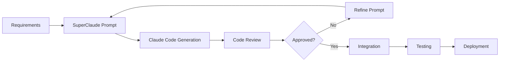

# SuperClaude Framework Integration Guide for Just Spent

## Overview
This guide details how to leverage the SuperClaude Framework for efficient code generation, testing, and deployment of the Just Spent application using Claude Code.

## SuperClaude Setup

### Prerequisites
- SuperClaude Framework installed
- Claude Code CLI configured
- API access to Claude Opus 4.1
- Git repository initialized

### Installation & Configuration

```bash
# Install SuperClaude Framework
npm install -g @superclaude/cli

# Initialize SuperClaude in project
superclaude init --project="just-spent" --type="mobile"

# Configure Claude Code integration
superclaude config set claude.model "claude-opus-4-1-20250805"
superclaude config set project.platforms "ios,android"
superclaude config set project.type "native-mobile"
```

### Project Structure for SuperClaude

```
just-spent/
├── .superclaude/
│   ├── config.yaml           # Framework configuration
│   ├── prompts/              # Custom prompts library
│   ├── templates/            # Code templates
│   └── context/              # Project context files
├── superclaude.yaml          # Project-specific settings
└── claude-sessions/          # Saved Claude Code sessions
```

## SuperClaude Configuration Files

### superclaude.yaml
```yaml
project:
  name: "Just Spent"
  description: "Voice-enabled expense tracker"
  version: "1.0.0"
  
platforms:
  ios:
    language: "Swift"
    min_version: "iOS 14.0"
    architecture: "MVVM"
    ui_framework: "SwiftUI"
    
  android:
    language: "Kotlin"
    min_version: "Android 6.0"
    architecture: "MVVM"
    ui_framework: "Jetpack Compose"
    
features:
  - voice_recognition
  - natural_language_processing
  - real_time_sync
  - offline_support
  - multi_currency
  - biometric_authentication
  
ai_components:
  expense_parser:
    model: "claude-opus-4-1-20250805"
    temperature: 0.3
    max_tokens: 2000
    
  category_classifier:
    model: "claude-opus-4-1-20250805"
    temperature: 0.2
    max_tokens: 1000
    
testing:
  coverage_target: 80
  test_framework:
    ios: "XCTest"
    android: "JUnit"
  ui_testing:
    ios: "XCUITest"
    android: "Espresso"
```

## Prompt Engineering Templates

### Code Generation Prompts

#### 1. Feature Implementation Prompt
```markdown
# Feature: ${FEATURE_NAME}

## Context
- Platform: ${PLATFORM}
- Architecture: ${ARCHITECTURE}
- Dependencies: ${DEPENDENCIES}

## Requirements
${REQUIREMENTS}

## Acceptance Criteria
${ACCEPTANCE_CRITERIA}

## Code Standards
- Follow SOLID principles
- Include comprehensive error handling
- Add inline documentation
- Implement unit tests
- Use dependency injection
- Follow platform-specific guidelines

## Generate
Please generate production-ready code for this feature including:
1. Model classes
2. View/ViewModel implementation
3. Service/Repository layers
4. Unit tests
5. Integration tests
```

#### 2. Voice Integration Prompt
```markdown
# Voice Integration for ${PLATFORM}

## Objective
Implement voice command processing for expense logging

## Voice Patterns to Support
- "I just spent [amount] [currency] on [category]"
- "I spent [amount] at [merchant]"
- "Log [amount] for [category]"

## Required Components
1. Voice intent handler
2. Natural language parser
3. Entity extractor
4. Validation logic
5. Error handling
6. Confirmation UI

## Platform-Specific Requirements
${PLATFORM_REQUIREMENTS}

Generate industrial-standard code with:
- Comprehensive error handling
- Multi-language support
- Accessibility compliance
- Performance optimization
- Security best practices
```

#### 3. Test Generation Prompt
```markdown
# Test Suite for ${COMPONENT}

## Test Coverage Requirements
- Unit tests: 85% minimum
- Edge cases: All identified
- Error scenarios: Comprehensive
- Performance tests: Included

## Test Categories
1. Happy path scenarios
2. Error handling
3. Edge cases
4. Integration points
5. Performance benchmarks

## Test Data
${TEST_DATA_SPECIFICATION}

Generate complete test suite with:
- Descriptive test names
- Proper setup/teardown
- Mocking/stubbing
- Assertions for all outcomes
- Documentation
```

### Context Files for Claude Code

#### context/app_architecture.md
```markdown
# Just Spent Architecture Context

## Core Principles
- Clean Architecture
- SOLID principles
- Dependency injection
- Reactive programming
- Testability first

## Layer Structure
1. **Presentation Layer**
   - Views/Activities
   - ViewModels/Presenters
   - UI State management

2. **Domain Layer**
   - Use cases
   - Business logic
   - Domain models

3. **Data Layer**
   - Repositories
   - Data sources
   - Network/Database

## Cross-Cutting Concerns
- Logging
- Analytics
- Error handling
- Security
- Performance monitoring
```

## Claude Code Session Templates

### Session 1: iOS Core Implementation
```bash
# Initialize Claude Code session
claude-code init --template=superclaude/ios-mvvm

# Load context
claude-code context add .superclaude/context/
claude-code context add docs/IOS_ARCHITECTURE.md
claude-code context add docs/DATA_MODELS.md

# Generate core components
claude-code generate "Create iOS expense model with Core Data integration"
claude-code generate "Implement expense repository with CRUD operations"
claude-code generate "Create expense list view with SwiftUI"
claude-code generate "Add expense view model with business logic"

# Generate tests
claude-code test "Generate comprehensive unit tests for expense model"
claude-code test "Create UI tests for expense list view"
```

### Session 2: Android Core Implementation
```bash
# Initialize Android session
claude-code init --template=superclaude/android-mvvm

# Load context
claude-code context add .superclaude/context/
claude-code context add docs/ANDROID_ARCHITECTURE.md
claude-code context add docs/DATA_MODELS.md

# Generate core components
claude-code generate "Create Kotlin data classes for expenses"
claude-code generate "Implement Room database with DAOs"
claude-code generate "Build expense list with Jetpack Compose"
claude-code generate "Create view model with Flow/LiveData"

# Generate tests
claude-code test "Generate JUnit tests for repository"
claude-code test "Create Espresso tests for UI components"
```

### Session 3: Voice Integration
```bash
# Voice feature session
claude-code init --template=superclaude/voice-integration

# Load platform-specific docs
claude-code context add docs/SIRI_INTEGRATION.md
claude-code context add docs/ASSISTANT_INTEGRATION.md

# Generate iOS voice components
claude-code generate "Implement Siri intent handler for expense logging"
claude-code generate "Create voice command parser with NLP"
claude-code generate "Build confirmation UI for voice input"

# Generate Android voice components
claude-code generate "Implement Google Assistant App Actions"
claude-code generate "Create deep link handler for voice commands"
claude-code generate "Build voice interaction service"
```

## Iterative Development Workflow

### 1. Feature Development Cycle


### 2. Test-Driven Development with Claude
```bash
# Step 1: Generate test specifications
claude-code spec "Create test spec for expense voice logging"

# Step 2: Generate failing tests
claude-code test "Generate tests from spec" --fail-first

# Step 3: Implement feature
claude-code generate "Implement feature to pass tests"

# Step 4: Refactor
claude-code refactor "Optimize and clean up implementation"

# Step 5: Verify
claude-code verify "Run all tests and verify coverage"
```

## Best Practices for Claude Code

### 1. Context Management
```bash
# Always load relevant context before generation
claude-code context clear
claude-code context add docs/
claude-code context add .superclaude/context/
claude-code context add existing-code/

# Save successful sessions
claude-code session save "feature-voice-integration"

# Reuse successful patterns
claude-code session load "feature-voice-integration"
```

### 2. Incremental Generation
```bash
# Generate small, focused components
claude-code generate "Create expense model" --max-lines=100

# Build upon previous generations
claude-code generate "Add validation to expense model"

# Request improvements
claude-code improve "Add error handling to last generation"
```

### 3. Code Review Integration
```bash
# Generate with review comments
claude-code generate "
  Create payment service
  Review notes:
  - Use dependency injection
  - Add retry logic
  - Include circuit breaker
  - Log all transactions
"

# Auto-fix review comments
claude-code fix "Address code review comments in PR #123"
```

## Quality Assurance with SuperClaude

### Automated Code Quality Checks
```yaml
# .superclaude/quality.yaml
quality_checks:
  pre_generation:
    - verify_context_loaded
    - check_dependencies
    - validate_architecture
    
  post_generation:
    - lint_code
    - check_formatting
    - verify_tests
    - measure_coverage
    - security_scan
    
  thresholds:
    coverage: 80
    complexity: 10
    duplication: 5
    security_score: 8
```

### Performance Optimization
```bash
# Analyze and optimize generated code
claude-code analyze "Check performance bottlenecks"
claude-code optimize "Improve query performance in expense repository"
claude-code benchmark "Generate performance tests"
```

## Deployment Automation

### CI/CD Integration
```yaml
# .github/workflows/superclaude.yml
name: SuperClaude Build
on: [push]
jobs:
  generate:
    runs-on: ubuntu-latest
    steps:
      - uses: actions/checkout@v3
      - name: Setup SuperClaude
        run: npm install -g @superclaude/cli
      - name: Generate Missing Components
        run: superclaude generate --missing-only
      - name: Run Tests
        run: superclaude test --all
      - name: Quality Check
        run: superclaude quality --strict
```

## Troubleshooting Guide

### Common Issues

1. **Context Too Large**
   ```bash
   # Solution: Use selective context
   claude-code context add --filter="*.swift" ios/
   ```

2. **Generation Not Following Style**
   ```bash
   # Solution: Add style guide to context
   claude-code context add STYLE_GUIDE.md --priority=high
   ```

3. **Tests Not Comprehensive**
   ```bash
   # Solution: Provide test examples
   claude-code example add tests/examples/
   ```

## Advanced SuperClaude Features

### 1. Multi-Agent Collaboration
```bash
# Use multiple Claude instances for complex features
superclaude orchestrate "
  agent: architect
    task: Design expense sync architecture
  agent: ios_dev
    task: Implement iOS sync service
  agent: android_dev
    task: Implement Android sync service
  agent: tester
    task: Create integration tests
"
```

### 2. Learning from Codebase
```bash
# Train on existing patterns
superclaude learn --from=successful-projects/
superclaude apply-learning --to=just-spent/
```

### 3. Continuous Improvement
```bash
# Analyze and improve over time
superclaude metrics collect
superclaude metrics analyze
superclaude improve --based-on=metrics
```

## Monitoring & Metrics

### Generation Metrics
```bash
# Track code generation effectiveness
superclaude metrics show --period=sprint

Metrics:
- Lines generated: 15,000
- Test coverage achieved: 85%
- Defects found: 12
- Time saved: 120 hours
- Quality score: 8.5/10
```

## Resources

- [SuperClaude Documentation](https://github.com/SuperClaude-Org/SuperClaude_Framework)
- [Claude Code Best Practices](https://docs.claude.com/claude-code)
- [Prompt Engineering Guide](https://docs.claude.com/prompting)
- [Mobile Development Templates](https://superclaude.org/templates)

---

*This integration guide ensures efficient use of SuperClaude and Claude Code for industrial-standard development.*